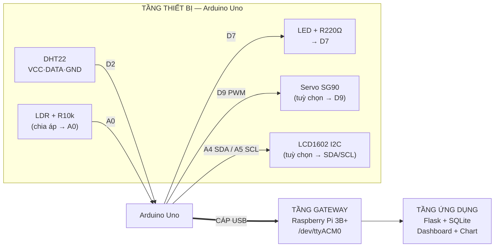

# Smart Greenhouse — Wiring (an toàn, ít dây)

## Nguyên tắc giảm rủi ro phần cứng
1. **Arduino nối Pi bằng cáp USB** (Arduino USB → cổng USB của Pi). KHÔNG dùng dây TX/RX.
   → Pi đọc tại `/dev/ttyACM0`. Loại bỏ hoàn toàn lỗi Arduino↔Pi trước đây + không cần hạ áp.
2. Mọi cảm biến/actuator nằm **hết trên Arduino** (Arduino có chân analog cho LDR; Pi thì không).
3. Servo + LCD là **tuỳ chọn** (Layer 2). Hỏng/không gắn → code vẫn chạy, demo không sập.

## Sơ đồ kết nối



## Bảng chân (pin map)

| Linh kiện | Chân Arduino | Ghi chú |
|---|---|---|
| DHT22 — DATA | D2 | VCC→5V, GND→GND. (module DHT22 thường có trở kéo sẵn) |
| LDR | A0 | Chia áp: 5V — LDR — A0 — R10kΩ — GND |
| LED grow-light | D7 | Nối tiếp trở 220Ω, chân dài (+) về D7, chân ngắn về GND |
| Servo SG90 *(opt)* | D9 (PWM) | Đỏ→5V, Nâu→GND, Cam→D9 |
| LCD1602 I2C *(opt)* | A4=SDA, A5=SCL | VCC→5V, GND→GND, địa chỉ 0x27 (nếu trắng màn → đổi 0x3F) |
| Arduino → Pi | **Cáp USB** | KHÔNG dùng TX/RX. Pi đọc /dev/ttyACM0 |

## Mạch chia áp LDR (chi tiết)
```
5V ──[ LDR ]──┬── A0
              │
            [ R 10kΩ ]
              │
             GND
```
Trời tối → LDR điện trở cao → điện áp A0 thấp → giá trị ADC thấp → bật đèn.
(Ngưỡng mặc định 400; chỉnh trên dashboard cho khớp ánh sáng phòng lab.)
